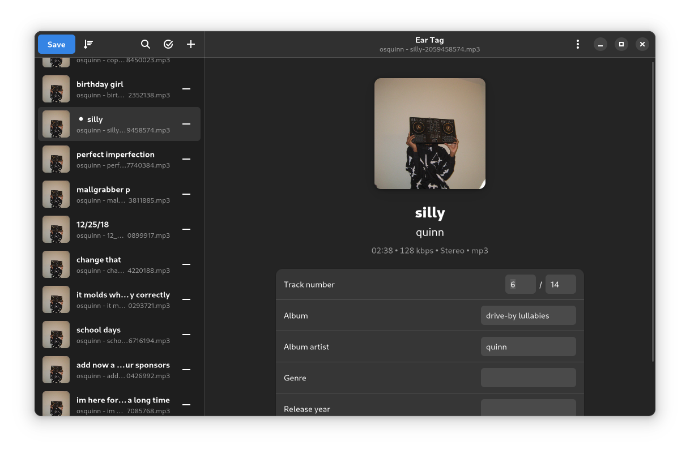

# Ear Tag

Small and simple music tag editor that doesn't try to manage your entire library



## Why?

A lot of music tag editors are made to apply changes to entire music libraries. They require you to set up a music folder, etc. This is convenient when you want to keep your entire library in check, but sometimes you just need to edit one file's data without any of the additional hassle.

Thus, Ear Tag was made to be a simple tag editor that can edit singular files as needed.

(Additionally, due to its compact design, it can be used on mobile Linux devices.)

## Installing

Ear Tag is available on [Flathub](https://flathub.org/apps/details/app.drey.EarTag), as well as the following software repositories:

[](https://repology.org/project/eartag/versions)

## Dependencies

Ear Tag is written in Python, and uses GTK4 and libadwaita for the UI. The following dependencies are required:

- Python >= 3.6
- GTK4
- libadwaita
- pygobject
- eyed3 (used for MP3 file tagging)
- pillow and mutagen (used for OGG and FLAC file tagging)
- pytaglib (used for tagging other files)
- python-magic (used for MIME type detection)

## Building

We use the meson build system. The build process is as follows:

```
meson output
meson compile -C output
meson install -C output
```

For development purposes, this is automated in the provided `run` script.

## Contributing

Project development happens on [GitHub](https://github.com/knuxify/eartag). For starters, check out the [open issues](https://github.com/knuxify/eartag/issues), or pick something from the TODO list below.

**Please follow the following commit style:**

 - All commits have a prefix that contains the area of the code that has been changed:
   - For the README.md file, build files (meson.build) and things like .gitignore, this is `meta:`
   - For anything in the data directory, this is `data:`
   - For anything related to translations or the po directory, this is `po:`
   - For the actual code, this is the filename of the main file you've edited, e.g. `fileview:`
 - Commit messages are in all lowercase, except for class names, filenames (if they're capitalized - like README, COPYING etc.) and project names (e.g. Musicbrainz).

## TODO

While Ear Tag is ready to use as-is, there are a few nice features that may be added in the near future. You can find them in our [bug tracker](https://github.com/knuxify/eartag/issues?q=is%3Aissue+is%3Aopen+label%3A%22feature+request%22).

The project's fully open-source, so if you feel like you could try to implement one of these features, feel free to do so and send a patch to us!
